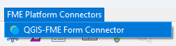

# QGIS-FME Form Connector

The QGIS-FME Form Connector plugin is a powerful tool that bridges QGIS and FME, enabling seamless data transformation and workflow automation between these two platforms. This plugin allows QGIS users to leverage FME's robust and powerful data transformation capabilities directly from the QGIS interface. Hence, in order to use this plugin, the users must make sure FME Form is installed and licensed to run.

It includes a default FME workspace (template) to help you get started. The template can be customized to the users needs. The workspace is located in the plugin folder directory under "FME Workspace/QGISFMEFormConnectorTemplate.fmw". 

The plugin can be downloaded from the official repository, [QGIS plugins repository](https://plugins.qgis.org/plugins/qgisfmeformconnector/) or directly from QGIS plugin manager, [QGIS manual](https://docs.qgis.org/3.40/en/docs/user_manual/plugins/plugins.html).

QGIS-FME Form Connector has been developed using QGIS 3.34.

## Key Features

- Direct FME workspace execution from QGIS.
- Parameter management for FME workspaces.
- Automated GeoJSON data handling.
- Real-time execution status monitoring.
- Workspace file browser and selector.
- Command-line parameter customization.
- Temporary and permanent layer output options.

## Interface

  

## Interface Overview

1.	File Browser Panel (Left):

    - Directory navigation tree.
    - Address bar for direct path entry.
    - Workspace file list.

2.	Workspace Information Panel (Left):

    - Workspace details and metadata.
    - Parameter table for customization.
    - Source and destination dataset configuration.

3.	Command Execution Panel (Right):

    - Command preview.
    - Execute button.
    - Output console.
    - Progress indicator.
    - Status messages.

## Tips

**Note:** The plugin requires a valid FME installation on your system.

Before using the plugin, ensure you have:
- FME Desktop installed (2020 or newer recommended).
- Access to FME workspaces (.fmw files).
    - Default .fmw workspace filename is **QGISFMEFormConnectorTemplate.fmw**. 
- Appropriate permissions to execute FME commands.

## Working with FME Workspaces

1. Selecting a Workspace:

    - Use the file browser to navigate to your FME workspace directory.
    - Click on an .fmw file to select it.
    - The workspace details will automatically load in the left panel.

2. The plugin will automatically:

    - Parse the workspace to identify parameters.
    - Display source and destination dataset information.
    - Generate a command line preview.

3. Workspace Compatibility:

  - The plugin works best with FME workspaces that:

    - Have clearly defined published parameters.
    - Use standard reader/writer formats.
    - Include appropriate error handling.

## Tutorial 

Guide for **QGIS-FME Form Connector** is available here: [QGIS-FME Form Connector](https://gis.com.my/training/qgis-plugin/qgis-fme-form-connector/)

## Installation

Go to *Plugins > Manage and Install Plugins.. > All*.

Search for **QGIS-FME Form Connector**.

OR

Download the zip file in [Github](https://github.com/gisinnovationmy/QGISFMEFormConnector).

Go to *Plugins > Manage and Install Plugins.. > Install from ZIP*.

After installation, the plugin will appear on the menu.

  

## Parameter Management

The parameter table allows you to customize how the FME workspace will execute:

1. Required Parameters:

    - **FME Executable:** Path to fme.exe on your system.
    - **Workspace:** Path to the selected .fmw file.
    - **Source Dataset:** Input data path.
    - **Destination Dataset:** Output data path.

2. Custom Parameters:

    - Additional parameters defined in the FME workspace.
    - Values can be edited directly in the table cells value.

3. Filename Generation:

    The plugin automatically generates standardized filenames for input and output datasets using the format:

    **YYYYMMDD_xxxxx_line2_[input/output].geojson**.

## License

This plugin is distributed under GNU GPL v.2 or any later version.

## Support

We've just begun and have implemented basic functionality so far. Our goal is to expand the range of services and introduce new features.

We appreciate any feedback, and pull requests are welcome on **GitHub**.

To get started, refer to the user guide, or you can ask questions and share comments in the discussion section.
